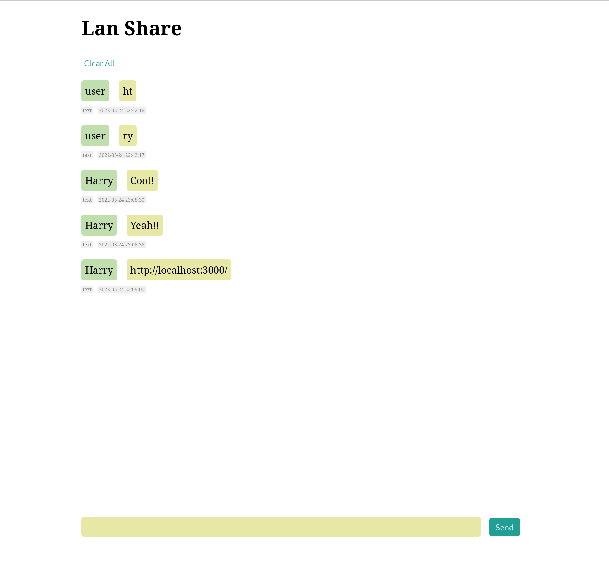

# lan-share

A simple chatbox-like pastebin service.
It is useful for transferring text between multiple devices, stashing thoughs, or just use it as a fake boring single user "chat room" :)

## Overview

This is a standalone uberjar which contains a server inside, all you need is to have java installed, and run `java -jar <newest-version-jar> <your-preferred-user-name>` (e.g. `java -jar lan-share-0.1.0-standalone.jar Harry`), then open "http://localhost:3000" to access it.

Click username box to delete this message.

It also provides RESTful API.
- GET "/api/entries": get all entries
- POST "/api/entries": add a new entry
- DELETE "/api/entries": delete some entries
- GET "/api/user": get the current username

Currently it only support plain text, more formats may be added in the future.

## Development

To get an interactive development environment run:

    clojure -A:fig:build

This will auto compile and send all changes to the browser without the
need to reload. After the compilation process is complete, you will
get a Browser Connected REPL. An easy way to try it is:

    (js/alert "Am I connected?")

and you should see an alert in the browser window.

To clean all compiled files:

    rm -rf target/public

To create a production build run:

	rm -rf target/public
	clojure -A:fig:min
